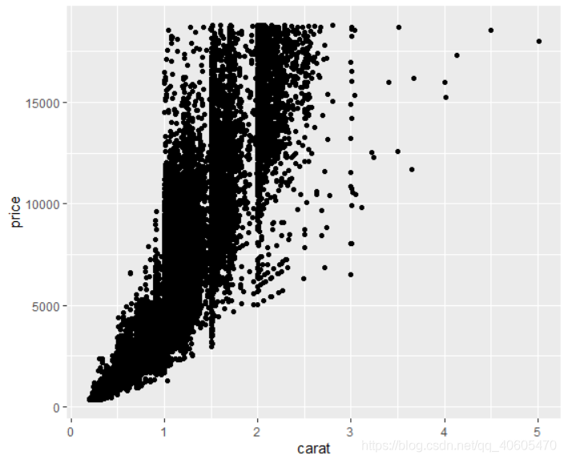

**参考书** 《ggplot2：数据分析与图形艺术》

**数据源**  diamonds数据集（数据已放在ggplot2软件包中）

# 一、散点图


```R
library(ggplot2)
diamonds <- diamonds
set.seed(1410) # 让样本可重复
dsamll <- diamonds[sample(nrow(diamonds),100),]
qplot(carat,price,data = diamonds)
```



<div align="center">图1 钻石价格和重量间关系散点图</div>


qplot()的前两个参数是x和y，分别代表图中所画对象的x坐标和y坐标。

data参数：如果指定，则qplot()将会首先在该数据框内查找变量名，再在R的工作空间中进行搜索。【推荐使用data参数】

图1显示出了变量间很强的相关关系，以及一些很明显的异常值。此外看出竖直方向上的相关关系似乎是指数型的，因此可以对变量进行一些变换。


```R
qplot(log(carat),log(price),data = diamonds)
```


<div align="center">图2 取对数后的散点图</div>
图2关系接近线性。

```R
qplot(carat,x*y*z,data = diamonds)
```


<div align = "center">图3 钻石体积和重量间的关系</div>
**数据集** dsmall

添加颜色

```R
dsmall <- dsmall
qplot(carat,price,data = dsmall,colour=color)
```


<div align = "center">图4 散点图添加颜色</div>


```R
qplot(carat,price,data = dsmall,shape=cut)
```


<div align = "center">图5 散点图添加形状</div>


可以利用I()来手动设定图形的属性，如：

```R
qplot(carat,price,data = diamonds,color = I("red"))
```


<div align = "center">图6 散点图指定颜色（红）</div>


```R
qplot(carat,price,data = diamonds,size = I(2))
```


<div align = "center">图7 散点图指定散点大小（2）</div>


```R
qplot(carat,price,data = diamonds,alpha = I(1/10))
```


<div align = "center">图8 散点图添加半透明(1/10)</div>
<div align = "center">取值从0(完全透明)到1(完全不透明)</div>


```
qplot(carat,price,data = diamonds,alpha = I(1/100))
```


<div align = "center">图9 散点图添加半透明(1/100)</div>


# 二、线状图

qplot并非只能画散点图，通过改变几何对象(geom)，它几乎画出任何一种类型的图形，按数据的维度进行划分：

**二维的变量关系**

- **geom = "point"** 绘制散点图，当指定了x和y参数给qplot()时默认的设置。
- **geom = "smooth"** 拟合一条平滑曲线，并将曲线和标准误展示在图中。
- **geom = "boxplot"** 绘制箱线胡须图，用以概括一系列点的分布情况。
- **geom = "path"** 和 **geom = "line"** 在数据点间绘制连线，这类图的作用是探索时间和其他变量间的关系，但连线同样可以用其他的方式将数据点连接起来。线条图只能创建从左到右的连线，而路径图则可以是任意的方向。

**一维的分布**

***对于连续变量***

- **geom = "histogram"** 绘制直方图。
- **geom = "freqploy"** 绘制频率多边形。
- **geom = "density"** 绘制密度曲线。

如果只有x参数传递给qplot，那么直方图的几何对象就是默认的选择。

***对于离散变量***

- **geom = "bar"** 用来绘制条形图。


如果在散点图中有非常多的数据点，那么数据展示的趋势可能并不明显，这种情况下应在图中添加一条平滑曲线。利用c()函数来将多个几何对象组成一个向量传递给geom，几何对象会按照指定的顺序进行堆叠。

```R
qplot(carat,price,data = dsmall, geom = c("point","smooth"))
```


<div align = "center">图10 散点图加入平滑曲线(dsmall)</div>


```R
qplot(carat,price,data = diamonds, geom = c("point","smooth"))
```


<div align = "center">图11 散点图加入平滑曲线(diamonds)</div>


如不想绘制标准误，则可以使用**se = FALSE**

```R
qplot(carat,price,data = diamonds, geom = c("point","smooth"),se = FALSE)
```


<div align = "center">图12 散点图加入平滑曲线，不绘制标准误(diamonds)</div>


利用**method**参数可以选择不同的平滑器，如：

- **method = "loess"** 当n较小时是默认选项，使用的是局部回归的方法。曲线的平滑程度是由span参数控制的，其取值范围是从0(很不平滑)到1(很平滑)。

```R
qplot(carat,price,data = dsmall, geom = c("point","smooth"),span = 0.2)
```


<div align = "center">图13 散点图加入平滑曲线，span(0.2)</div>
```R
qplot(carat,price,data = dsmall, geom = c("point","smooth"),span = 1)
```


<div align = "center">图14 散点图加入平滑曲线，span(1)</div>
Loess对于大数据并不十分适用（内存的消耗是O(n^2)），因此当n超过1000时将默认采用另一种平滑算法。

- **method = "gam", formula = y  ~ s(x)** 调用mgcv包拟合一个广义可加模型。对于大数据，请使用公式**y ~ s(x, bs = "cs")**，这是数据量超过1000时默认使用的选项。

```R
library(mgcv)
qplot(carat,price,data = dsmall, geom = c("point","smooth"),method = "gam", formula = y ~ s(x))
```


<div align = "center">图15 formula = y ~ s(x)</div>


```R
qplot(carat,price,data = dsmall, geom = c("point","smooth"),method = "gam", formula = y ~ s(x, bs = "cs"))
```


<div align = "center">图16 formula = y ~ s(x, bs = "cs")</div>
- **method = "lm"** 拟合的是线性模型。默认情况下会拟合一条直线，但可以通过指定formula = y ~ poly(x, 2) 来拟合一个二次多项式或加载splines包以使用自然样条：formula = y ~ ns(x, 2)。第二个参数是自由度：自由度取值越大，曲线的波动也越大。

  ```R
  library(splines)
  qplot(carat, price, data = dsmall, geom = c("point", "smooth"), method = "lm")
  ```

  

<div align = "center">图17 method = "lm", formula = y ~ x</div>


```R
qplot(carat, price, data = dsmall, geom = c("point", "smooth"), method = "lm", formula = y ~ ns(x,5))
```


<div align = "center">图18 method = "lm", formula = y ~ ns(x, 5)</div>


- **method = "rlm"** 与lm类似，但采用了一种更稳健的拟合算法，使得结果对异常值不太敏感。需要先加载MASS包。

```R
library(MASS)
qplot(carat, price, data = dsmall, geom = c("point", "smooth"), method = "rlm")
```


<div align = "center">图19 method = "rlm"</div>


# 三、扰动点图

**geom = "jitter"**

```R
qplot(color, price / carat, data = diamonds, geom = "jitter")
```


<div align = "center">图20 扰动点图</div>
扰动点图将所有的点都绘制到图中（存在图形重叠的问题）。图形重叠问题可以通过半透明颜色来部分解决，即使用alpha参数。

以下展示三种水平的透明度：

```R
qplot(color, price / carat, data = diamonds, geom = "jitter", alpha = I(1 / 5))
```


<div align = "center">图21 扰动点图，透明度1/5</div>


```R
qplot(color, price / carat, data = diamonds, geom = "jitter", alpha = I(1 / 50))
```


<div align = "center">图22 扰动点图，透明度1/50</div>


```R
qplot(color, price / carat, data = diamonds, geom = "jitter", alpha = I(1 / 200))
```


<div align = "center">图23 扰动点图，透明度1/200</div>


# 四、箱线图


```R
qplot(color, price / carat, data = diamonds, geom = "boxplot")
```


<div align = "center">图24 箱线图</div>


# 五、直方图


```R
qplot(carat, data = diamonds, geom = "histogram")
```


<div align = "center">图25 钻石重量的直方图</div>
对于直方图而言，binwidth参数通过设定组距来调节平滑度。当组距较大时，图形能反映数据的总体特征；当组距较小时，则能显示出更多的细节。

以下尝试三种binwidth的取值：

```R
qplot(carat, data = diamonds, geom = "histogram", binwidth = 1, xlim = c(0,3))
```


<div align = "center">图26 组距1</div>


```R
qplot(carat, data = diamonds, geom = "histogram", binwidth = 0.1, xlim = c(0,3))
```


<div align = "center">图27 组距0.1</div>


```R
qplot(carat, data = diamonds, geom = "histogram", binwidth = 0.01, xlim = c(0,3))
```


<div align = "center">图28 组距0.01</div>


要在不同组之间对分布进行对比，只需要再加上一个图形映射：

```R
qplot(carat, data = diamonds, geom = "histogram", fill = color)
```


<div align = "center">图29 添加图形映射</div>
当一个分类变量被映射到某个图形属性上，几何对象会自动按这个变量进行拆分。因此上述命令告诉qplot()对每一种钻石颜色都绘制一次直方图。密度曲线图同。


# 六、密度曲线图


```R
qplot(carat, data = diamonds, geom = "density")
```


<div align = "center">图30 钻石重量的密度曲线图</div>
对于密度曲线图而言，adjust参数控制了曲线的平滑程度(adjust取值越大，曲线越平滑)。


```R
qplot(carat, data = diamonds, geom = "density", colour = color)
```


<div align = "center">图31 钻石重量的密度曲线图，添加图形映射</div>


# 七、条形图


```R
qplot(color, data = diamonds, geom = "bar")
```


<div align = "center">图32 普通条形图</div>


按weight = carat进行加权，展示了每种钻石的总重量。

```R
qplot(color, data = diamonds, geom = "bar", weight = carat) + scale_y_continuous("carat")
```


<div align = "center">图33 按重量加权的条形图</div>


# 八、时间序列中的线条图

线条图和路径图常用于可视化时间序列数据。线条图将点从左到右进行连接，而路径图则按照点在数据集中的顺序对其进行连接。

diamonds数据集中没有包含时间变量，因此这里使用economics数据集，它包含了美国过去40年的经济数据。

接下来展示失业水平随时间变化的线条图，**geom = "line"**：

```R
qplot(date, unemploy / pop, data = economics, geom = "line")
```


<div align = "center">图34 失业率的变化线条图</div>


```R
qplot(date, uempmed, data = economics, geom = "line")
```


<div align = "center">图35 失业星期数的中位数线条图</div>


# 九、路径图


```R
year <- function(x) as.POSIXlt(x)$year + 1900
qplot(unemploy / pop, uempmed, data = economics, geom = c("point", "path"))
```


<div align = "center">图36 展示失业率和失业时间长度之间关系的路径图（重叠在一起的散点图和路径图）</div>


```R
qplot(unemploy / pop, uempmed, data = economics, geom = "path", colour = year(date))
```


<div align = "center">图37 展示失业率和失业时间长度之间关系的路径图（将年份映射到了colour属性上）</div>


# 十、分面

**分面**：将数据分割成若干子集，然后创建一个图形的矩阵，将每一个子集绘制到图形矩阵的窗格中。所有子图采用相同的图形类型，并进行了一定的设计，使得它们之间方便进行比较。


```R
qplot(carat, data = diamonds, facets = color ~ ., geom = "histogram", binwidth = 0.1, xlim = c(0, 3))
```


<div align = "center">图38 频数 直方图</div>


```R
qplot(carat, ..density.., data = diamonds, facets = color ~ ., geom = "histogram", binwidth = 0.1, xlim = c(0, 3))
```


<div align = "center">图39 频率 直方图</div>
..density.. 是一个新语法，它告诉ggplot2将密度而不是频数映射到y轴。


# 十一、其他选项

- **xlim, ylim**：设置x轴和y轴的显示区间，它们的取值都是一个长度为2的数值向量，例如xlim = c(0, 20)或ylim = c(-0.9, -0.5)；
- **log**：一个字符型向量，说明哪一个坐标轴应该取对数。例如，log = "x"表示对x轴取对数，log = "xy"表示对x轴和y轴都取对数；
- **main**：图形的主标题，放置在图形的顶端中部，以大字号显示。该参数可以是一个字符串(main = "plot title")或一个表达式(main = expression(beta[1] = 1))。可以运行?plotmath命令来查看更多数学表达式例子；
- **xlab, ylab**：设置x轴和y轴的标签文字，与主标题一样，这两个参数的取值可以是字符串或数学表达式。


```R
qplot(
  carat, price, data = dsmall,
  xlab = "Price($)", ylab = "Weight(carats)",
  main = "Price-weight relationship"
  )
```


<div align = "center">图40 添加主标题，x和y轴的标签文字</div>


```R
qplot(
  carat, price/carat, data = dsmall,
  ylab = expression(frac(price, carat)),
  xlab = "Weight (carats)",
  main = "Small diamonds",
  xlim = c(.2, 1)
  )
```


<div align = "center">图41 数学表达式使用</div>


```R
qplot(carat, price, data = dsmall, log = "xy")
```


<div align = "center">图42 log函数使用</div>